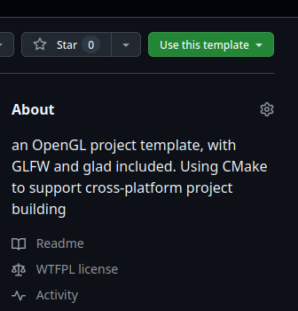

# OpenGL Project Template

This project is a corss-platform template for learning OpenGL in a Windows or Linux environment. It includes a CMake configuration, and
1. GLAD for loading OpenGL functions
2. GLFW for creating windows and handling input
3. glm for mathematical calculation

The provided CMake configuration allows to build the project using command line tools, making it easy to compile and run the project on Windows without opening Visual Studio.

## Project Structure
```
OpenGL-Project-Template/  
├── code/  
│   └── main.cpp  #*write code here*  
├── include/  
│    ├── glad/  
│    │    └── glad.c  
│    │    └── glad.h  
│    ├── GLFW/
│    ├──glm
│    └──KHR  
├── CMakeLists.txt  
├── license  
└── README.md
```

## Prerequisites

- CMake 3.10 or higher
- A C++ compiler (e.g., MSVC, GCC)
- Git (optional, for cloning repositories)
- (On windows) Visual Studio or MinGW
- (On linux) Wayland, X11
    - refer to https://www.glfw.org/docs/latest/compile.html for further information

## Setup

1. **Create your new repository by this template:**

    
2. **Clone the repository:** 

    ***replace the address with your own repository***
   ```sh
   git clone https://github.com/Orcalcium/OpenGL_Project_Template.git
   cd OpenGL_Project_Template
   ``` 
3. **Add CMake to system PATH:**

    Ensure that CMake is installed and added to system PATH. download CMake from [cmake.org](https://cmake.org/download/).
    Enter
    ```sh
    cmake --version
    ```
    in terminal to check whether cmake is correctly installed
4. **Update submodule**

    ```sh
    git submodule init
    git submodule update
    ```
5. **Build GLFW**
    ```sh
    # in project's root directory
    cd ./include/GLFW/build
    cmake ../source/glfw/
    cmake --build . --config Release
    cmake --install . --prefix ../install
    cd ../../..
    ```
    
## Project Building
#### 1.run CMake:
```sh
# in project's root directory
cmake .
```
#### 2.Build the project
```sh
# in project's root directory
cmake --build .
```
#### 3.Running the project
After building, run the exectuable by
- on Windows
```sh
./Debug/project.exe
```
- on Linux
```sh
./project
```
## License

This project **except contents in /include directory** is licensed under the WTFPL License - see the [license](./license) file for details.